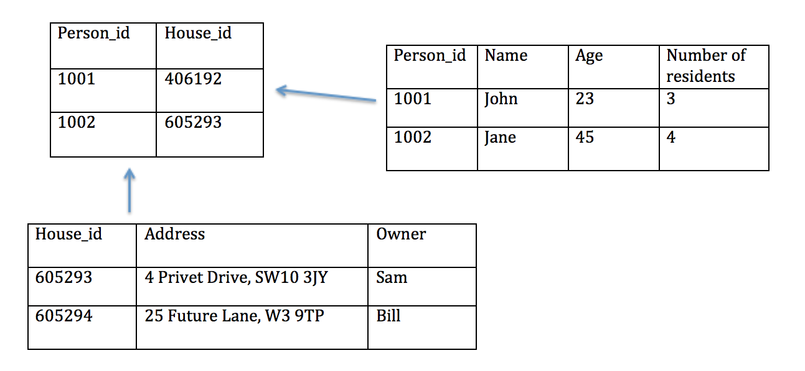

# Neighbourhood Collaboration Site

## A system to keep track of people, houses, and addresses of those houses.

1. Consider the type of data we will be storing and therefore the type of database we should implement (SQL vs NoSQL)

- Relational database with SQL

2. Create a schema for this database

3. Consider the requests our API should be capable of handling

- Store people, houses and addresses
- Look up a house, it’s address and owner
- Look up people in our neighbourhood within certain age brackets and with specific household sizes

4. List the routes you will need with their HTTP verb and path

- GET     /people

- GET     /people/:id

- PATCH   /people/:id

- GET     /houses

- GET     /houses/:id    

- GET     /houses/:id/edit

- PATCH   /houses/:id

- DELETE  /houses/:id

5. Determine the responses that should be returned and the content types of these requests and responses

